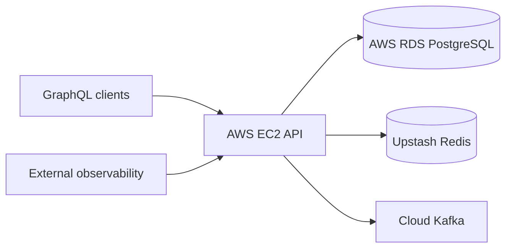

# Marketing Company API

GraphQL backend for CRM and marketing operations — Java 23, Spring Boot 3.4, hexagonal architecture.

[](https://openjdk.org/)
[](https://spring.io/projects/spring-boot)
[](https://graphql.org/)

---

## Table of contents

- [About](#about)
- [Features](#features)
- [Documentation](#documentation)
- [Tech stack](#tech-stack)
- [Architecture at a glance](#architecture-at-a-glance)
- [Prerequisites](#prerequisites)
- [Quick start](#quick-start)
- [Configuration](#configuration)
- [API overview](#api-overview)
- [Project structure](#project-structure)
- [Deployment](#deployment)
- [Testing](#testing)
- [Maintaining documentation](#maintaining-documentation)
- [Contributing](#contributing)
- [Security & compliance](#security--compliance)
- [License](#license)

---

## About

Minimalist but production-ready API that unifies **CRM** (companies, opportunities, deals, quotes, tasks) and **marketing** (campaigns, channels, metrics, assets, A/B tests) behind a single GraphQL endpoint.

The service is **deployed on AWS**: application on **EC2**, PostgreSQL on **RDS**, sessions and rate limits on **Upstash Redis**, with **Kafka** consumed from a cloud-managed broker and **external observability** via Spring Actuator (Prometheus scrape).

| | |
|---|---|
| **Version** | 0.0.1-SNAPSHOT |
| **Status** | Deployed (AWS) |
| **Primary API prefix** | `/api` |
| **Live / health check** | [https://{{YOUR_EC2_OR_ALB_HOST}}/api/actuator/health](https://{{YOUR_EC2_OR_ALB_HOST}}/api/actuator/health) |
| **GraphQL** | [https://{{YOUR_EC2_OR_ALB_HOST}}/api/graphql](https://{{YOUR_EC2_OR_ALB_HOST}}/api/graphql) |

Replace `{{YOUR_EC2_OR_ALB_HOST}}` with your public EC2 or ALB hostname.

---

## Features

- GraphQL API with modular schema (account, CRM, customer, marketing)
- JWT authentication with Redis-backed sessions (Upstash in production)
- Rate limiting on sensitive GraphQL operations
- Hexagonal / DDD domain modules with Flyway migrations
- Docker Compose for local full stack or infra-only development
- Actuator health, metrics, and Prometheus export

Full breakdown: [Project Features](docs/project/generated/ProjectFeature.md).

---

## Documentation

Structured source lives in `docs/project/source/` (YAML frontmatter). Human-readable docs are generated in **`docs/project/generated/`**.

### Documentation index

| Document | What you will find | Read |
|----------|-------------------|------|
| **Overview** | Problem, solution, metrics, links | [ProjectOverview.md](docs/project/generated/ProjectOverview.md) |
| **Metadata** | Project id, version, tech stack, URLs | [ProjectMetadata.md](docs/project/generated/ProjectMetadata.md) |
| **API schema** | GraphQL operations, auth, rate limits | [APISchema.md](docs/project/generated/APISchema.md) |
| **Architecture** | Layers, patterns, diagram, data flows | [ProjectArchitecture.md](docs/project/generated/ProjectArchitecture.md) |
| **Infrastructure** | AWS EC2/RDS, Upstash, Kafka, Docker | [ProjectInfrastructure.md](docs/project/generated/ProjectInfrastructure.md) |
| **Features** | Feature cards, status per area | [ProjectFeature.md](docs/project/generated/ProjectFeature.md) |
| **Code showcase** | Curated code examples | [ProjectCodeShowCase.md](docs/project/generated/ProjectCodeShowCase.md) |
| **Generated index** | Hub linking all generated docs | [docs/project/generated/README.md](docs/project/generated/README.md) |

### Additional references

| Document | Path |
|----------|------|
| Docker setup | [docker/README.md](docker/README.md) |
| Architecture (extended) | [docs/ARCHITECTURE.md](docs/ARCHITECTURE.md) |
| Deployment guide | [docs/DEPLOYMENT.md](docs/DEPLOYMENT.md) |
| Environment template | [.env.example](.env.example) |

### Source vs generated

| Path | Purpose |
|------|---------|
| `docs/project/source/*.md` | Edit YAML frontmatter here (matches `docs/project/source/schema.ts`) |
| `docs/project/generated/*.md` | Read on GitHub / in the IDE — regenerate, do not edit by hand |
| `docs/project/yaml_to_markdown.py` | Regenerates `docs/project/generated/` from source |

```bash
python3 -m venv .venv && source .venv/bin/activate
pip install pyyaml
python docs/project/yaml_to_markdown.py
deactivate && rm -rf .venv
```

---

## Tech stack

- **Runtime:** Java 23, Spring Boot 3.4.2, Gradle 8.11
- **API:** Spring GraphQL, schema-first SDL
- **Security:** Spring Security, JWT (jjwt), BCrypt
- **Data:** PostgreSQL 16 (RDS), Flyway, Spring Data JPA
- **Cache / sessions:** Redis (Upstash in AWS)
- **Messaging:** Apache Kafka (cloud broker, env-configured)
- **Observability:** Spring Actuator, Prometheus metrics
- **Local dev:** Docker Compose, spring-dotenv

---

## Architecture at a glance

Hexagonal architecture with bounded contexts for **account**, **CRM**, **customer**, and **marketing**. GraphQL adapters call application services, which use domain logic and JPA/Redis output adapters.



Details: [ProjectArchitecture.md](docs/project/generated/ProjectArchitecture.md).

---

## Prerequisites

- Java 23 (SDKMAN or Temurin)
- Gradle 8.11+ (wrapper included)
- Docker & Docker Compose (local containers)
- PostgreSQL 16 and Redis (or use Docker — see `docker/README.md`)

---

## Quick start

### Local full stack (app + Postgres + Redis in Docker)

```bash
git clone https://github.com/alexisTrejo11/marketing-company-api
cd marketing-company-api
cp .env.example .env   # set DB_PASSWORD, JWT_* secrets

docker compose -f docker/compose.full.yml --env-file .env up --build
```

- API: http://localhost:8081/api/graphql (default `APP_HOST_PORT`)
- Health: http://localhost:8081/api/actuator/health

### Deploy app only (RDS + Upstash from `.env`)

For EC2 or production — no local databases in Compose:

```bash
cp .env.example .env   # RDS, Upstash REDIS_URL, JWT_* secrets
docker compose -f docker/compose.deploy.yml --env-file .env up --build -d
```

- API: http://localhost:8080/api/graphql

### Run on host (IDE / Gradle)

```bash
cp .env.example .env   # cloud DB_* and REDIS_URL
./gradlew bootRun
```

See [docker/README.md](docker/README.md) for details.

---

## Configuration

Copy [.env.example](.env.example) to `.env`. Minimum variables:

| Variable | Description |
|----------|-------------|
| `JWT_ACCESS_SECRET` / `JWT_REFRESH_SECRET` | JWT signing keys (min. 32 chars) |
| `DB_*` | PostgreSQL — host, port, name, user, password (RDS endpoint in AWS) |
| `REDIS_URL` | Redis connection URL (`rediss://…` Upstash; `redis://…` local/Docker) |
| `DB_HOST_PORT` / `REDIS_HOST_PORT` | Docker Compose host port mappings only |
| `CORS_ALLOWED_ORIGINS` | Comma-separated frontend origins |
| `KAFKA_BOOTSTRAP_SERVERS` | Cloud Kafka broker (production) — `{{YOUR_KAFKA_BROKER}}` |

Full list: [.env.example](.env.example).

---

## API overview

| Area | GraphQL operations | Doc |
|------|-------------------|-----|
| Auth | `signUp`, `login`, `refreshToken`, `logout`, `logoutAll` | [APISchema.md](docs/project/generated/APISchema.md) |
| Account | User profile, admin user management | [APISchema.md](docs/project/generated/APISchema.md) |
| CRM | Companies, opportunities, deals, quotes, tasks, interactions | [APISchema.md](docs/project/generated/APISchema.md) |
| Marketing | Campaigns, channels, metrics, assets, A/B tests | [APISchema.md](docs/project/generated/APISchema.md) |
| Observability | `GET /api/actuator/health`, `/prometheus` | [APISchema.md](docs/project/generated/APISchema.md) |

Authentication: `Authorization: Bearer <access_token>` on protected fields.

---

## Project structure

```
marketing-company-api/
├── src/main/java/at/backend/MarketingCompany/
│   ├── account/          # Auth & users
│   ├── customer/         # Customer companies
│   ├── crm/              # Opportunities, deals, quotes, tasks, …
│   ├── marketing/        # Campaigns, metrics, assets, …
│   ├── config/           # Security, CORS, rate limit, GraphQL
│   └── shared/           # Cross-cutting DTOs, exceptions
├── src/main/resources/
│   ├── application.yml
│   └── graphql/          # Schema-first SDL modules
├── docker/
│   ├── Dockerfile
│   ├── compose.full.yml
│   ├── compose.deploy.yml
│   └── README.md
├── docs/project/
│   ├── source/           # YAML source (edit these)
│   ├── generated/        # Readable Markdown (generated)
│   └── yaml_to_markdown.py
├── build.gradle
└── .env.example
```

---

## Deployment

**Production (current):** Spring Boot on **AWS EC2**, **RDS PostgreSQL**, **Upstash Redis**, Kafka consumer against a **cloud broker**, metrics scraped from `/api/actuator/prometheus`.

Checklist and env matrix: [ProjectInfrastructure.md](docs/project/generated/ProjectInfrastructure.md).

Local Docker: [docker/README.md](docker/README.md).

---

## Testing

```bash
./gradlew test
```

Integration tests use the `test` profile (H2 in-memory). Context load test: `CrmApplicationTests`.

---

## Maintaining documentation

1. Edit YAML frontmatter in `docs/project/source/<Section>.md`.
2. Run `python docs/project/yaml_to_markdown.py` (requires PyYAML).
3. Commit both `docs/project/source/` and `docs/project/generated/` for GitHub visibility.

Notes below the YAML closing `---` appear under **Additional notes** in generated files.

---

## Contributing

1. Fork the repository
2. Create a feature branch (`git checkout -b feature/my-change`)
3. Commit with clear messages
4. Open a pull request against `main`

---

## Security & compliance

- Never commit `.env` or JWT/database secrets.
- Use `SPRING_PROFILES_ACTIVE=prod` on EC2 (GraphiQL and introspection disabled).
- Rotate JWT secrets and RDS credentials via your secrets workflow.
- Rate limits depend on Redis — ensure Upstash is reachable before go-live.

Report vulnerabilities privately to the repository owner.

---

## License

See [LICENSE](LICENSE) if present; otherwise all rights reserved by the project author.

---

## Links

| Resource | URL |
|----------|-----|
| Repository | [github.com/alexisTrejo11/marketing-company-api](https://github.com/alexisTrejo11/marketing-company-api) |
| Documentation hub | [docs/project/generated/README.md](docs/project/generated/README.md) |
| Health (production) | `https://{{YOUR_EC2_OR_ALB_HOST}}/api/actuator/health` |
