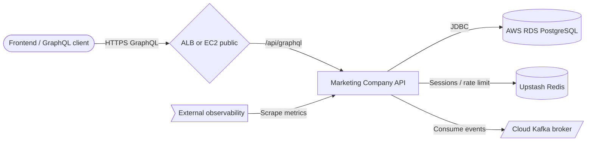

# Architecture

## Input adapters (GraphQL)

GraphQL controllers map schema operations to application commands and queries.

### Components

- AuthController
- UserController / UserManagerController
- CompanyController
- OpportunityQueryController / OpportunityMutationController
- DealController
- QuoteQueryController / QuoteCommandController
- TaskController
- InteractionController (CRM)
- ServicePackageController
- MarketingCampaignQueryController / MarketingCampaignMutationController
- MarketingChannelController
- ActivityQueryController / ActivityMutationController
- CampaignMetricQueryController / CampaignMetricMutationController
- AssetQueryController / AssetMutationController
- AbTestQueryController / AbTestMutationController
- CampaignInteractionController / CampaignInteractionMutationController

### Responsibilities

- Validate GraphQL inputs (Jakarta Validation)
- Map DTOs to commands/queries
- Apply rate-limit and security directives

### Technologies

- Spring GraphQL
- graphql-java-tools

## Application layer

Use-case orchestration — command handlers, query services, mappers.

### Components

- AuthCommandHandler
- UserCommandServiceImpl
- Domain command/query services per bounded context

### Responsibilities

- Transaction boundaries
- Authorization checks at use-case level
- Coordinate domain entities and ports

### Technologies

- Spring @Service
- @Transactional

## Domain layer

Business rules, entities, value objects, domain exceptions, and events.

### Components

- account (User, AuthSession, Role, passwords)
- customer (CustomerCompany, CompanyName, ContactPerson)
- crm (Opportunity, Deal, Quote, Task, Interaction, ServicePackage)
- marketing (Campaign, Channel, Activity, Metric, Asset, AbTest, Attribution)

### Responsibilities

- Invariants and validation
- Aggregate consistency
- Domain-specific exceptions

### Technologies

- Plain Java records and classes
- DDD patterns

## Output adapters (persistence & external)

JPA repositories, Redis session store, JWT provider, future Kafka listeners.

### Components

- JPA entities and repository adapters
- RedisAuthSessionRepositoryImpl
- JwtTokenProvider
- Flyway migrations

### Responsibilities

- Persist aggregates to PostgreSQL (RDS)
- Store auth sessions in Redis (Upstash)
- Issue and validate JWTs

### Technologies

- Spring Data JPA
- Spring Data Redis
- Flyway
- PostgreSQL

## Cross-cutting (config)

Security, CORS, rate limits, logging, GraphQL wiring.

### Components

- SecurityConfig
- JwtAuthenticationFilter
- CorsConfig / CorsProperties
- GraphQLRateLimit / RateLimitProperties
- GlobalGraphQLExceptionHandler
- GraphQlAuditInterceptor

### Responsibilities

- Stateless JWT security filter chain
- CORS from env (`CORS_ALLOWED_ORIGINS`)
- Audit and error shaping

### Technologies

- Spring Security
- Spring AOP
- Actuator

## Design patterns

| Pattern | Category | Description |
| --- | --- | --- |
| ⬡ Hexagonal Architecture | Structural | Ports and adapters isolate domain from GraphQL, JPA, and Redis. |
| 🏛 Domain-Driven Design | Strategic | Bounded contexts for account, CRM, customer, and marketing. |
| ↔ CQRS (light) | Behavioral | Separate command and query types per use case without event sourcing. |
| 📦 Repository | Structural | Output ports abstract persistence behind adapter implementations. |
| 💎 Value Object | Domain | Immutable types (Email, DealStatus, UTMParameters, etc.) enforce invariants. |

## Scalability strategies

- **Stateless API tier** — JWT + Redis sessions allow horizontal scaling of EC2 instances behind a load balancer.
- **Managed data stores** — RDS and Upstash handle connection pooling and replication outside the app.
- **Connection pooling** — HikariCP (max 20 connections) tuned for RDS limits.

## Security strategies

- **JWT dual secrets** — Separate access and refresh signing keys (`JWT_ACCESS_SECRET`, `JWT_REFRESH_SECRET`).
- **BCrypt passwords** — Passwords hashed before persistence; plain passwords validated at domain level.
- **Rate limiting** — Redis-backed limits on sensitive GraphQL operations.
- **CORS allow-list** — Origins from environment; credentials enabled for SPA clients.
- **Prod hardening** — GraphiQL off, reduced stack traces, SQL logging disabled in `prod` profile.

## Cache strategies

| Name | TTL | Coverage | Description |
| --- | --- | --- | --- |
| Redis auth sessions | Session TTL (refresh token expiry, default 30 days) | Authentication | Refresh tokens and user session sets |
| Redis rate limits | 60s – 1h depending on profile | API protection | Counters for global and per-operation limits |
| Caffeine (in-process) | 300–600 seconds | Read-heavy lookups | Company and customer entity caches |

## Architecture highlights

### 📜 Schema-first GraphQL

SDL files in `graphql/` loaded automatically by Spring GraphQL.

### 🔄 Flyway migrations

Versioned SQL migrations; ddl-auto validate mode in production.

### ⚙ Profile-based config

dev, docker, prod, and test profiles in `application.yml`.

### 📊 External observability

Actuator health and Prometheus metrics scraped from EC2.

## Architecture diagram

### Legend

| Type | Label |
| --- | --- |
| client | Client (SPA / tools) |
| gateway | ALB / EC2 |
| service | Spring Boot API |
| database | RDS PostgreSQL |
| database | Upstash Redis |
| queue | Cloud Kafka |
| monitoring | Prometheus / logs |

### Nodes

| ID | Label | Type | Status |
| --- | --- | --- | --- |
| spa | Frontend / GraphQL client | client | healthy |
| alb | ALB or EC2 public | gateway | healthy |
| api | Marketing Company API | service | healthy |
| rds | AWS RDS PostgreSQL | database | healthy |
| upstash | Upstash Redis | database | healthy |
| kafka | Cloud Kafka broker | queue | healthy |
| prom | External observability | monitoring | healthy |

### Connections

| From | To | Label | Protocol |
| --- | --- | --- | --- |
| spa | alb | HTTPS GraphQL | HTTPS |
| alb | api | /api/graphql | HTTP |
| api | rds | JDBC | TCP |
| api | upstash | Sessions / rate limit | TLS |
| api | kafka | Consume events | Kafka |
| prom | api | Scrape metrics | HTTP |

### Mermaid overview

## Data flow

### Request flow

1. **Client request** — POST /api/graphql with optional Bearer token
2. **Security filter** — JwtAuthenticationFilter validates access token and loads roles
3. **Rate limit check** — GraphQLRateLimit aspect enforces Redis counters
4. **Controller → command** — GraphQL controller maps input to application command/query
5. **Domain + persistence** — Handler executes domain logic via output port adapters (JPA/Redis)
6. **Response** — Mapped DTO returned as GraphQL data or structured error

### Event flow

1. **External event published** — Upstream system produces message to cloud Kafka topic
2. **Consumer on EC2** — App instance consumes via KAFKA_BOOTSTRAP_SERVERS (env)
3. **Domain handler** — Event mapped to application command (integration boundary)
4. **Side effects** — Persist to RDS and/or invalidate Redis cache as needed

## Technical decisions

### GraphQL over REST

**Problem:** Multiple CRM and marketing clients need flexible reads without version explosion.

**Solution:** Single GraphQL schema with modular SDL and Spring GraphQL controllers.

**Outcome:** One endpoint, strong typing, GraphiQL for developer experience.

#### Alternatives considered

- OpenAPI REST with many DTO permutations
- gRPC for internal-only clients

### Hexagonal modules per domain

**Problem:** Marketing and CRM logic must stay testable as the system grows.

**Solution:** package-by-domain with explicit ports (input/output) and adapters.

**Outcome:** Clear boundaries; swap GraphQL or JPA without touching domain rules.

#### Alternatives considered

- Layered package-by-technical-concern
- Monolithic service class

### Upstash Redis instead of self-hosted on EC2

**Problem:** Session and rate-limit state must survive app restarts and scale horizontally.

**Solution:** Managed Upstash Redis with TLS; configured via SPRING_REDIS_HOST in production.

**Outcome:** No Redis ops on EC2; suitable for minimalist deployment.

#### Alternatives considered

- Redis container on same EC2
- ElastiCache

### AWS RDS for PostgreSQL

**Problem:** Need durable relational storage with backups for CRM/marketing data.

**Solution:** RDS PostgreSQL 16; Flyway migrations on startup.

**Outcome:** Managed backups and patching; app connects via JDBC env vars.

#### Alternatives considered

- PostgreSQL in Docker on EC2
- Aurora Serverless

## Additional notes

# Project Architecture

> **Important:** Kafka appears in the architecture diagram as an **external** cloud broker.
> Consumer configuration is environment-driven — the repository does not embed broker URLs.

> **Warning:** Never run `ddl-auto: update` in production. The project uses `validate` + Flyway.

> **Useful note:** Package layout follows `at.backend.MarketingCompany.<domain>.<adapter|core>`.
> Shared kernel lives under `shared/` and cross-cutting under `config/`.

